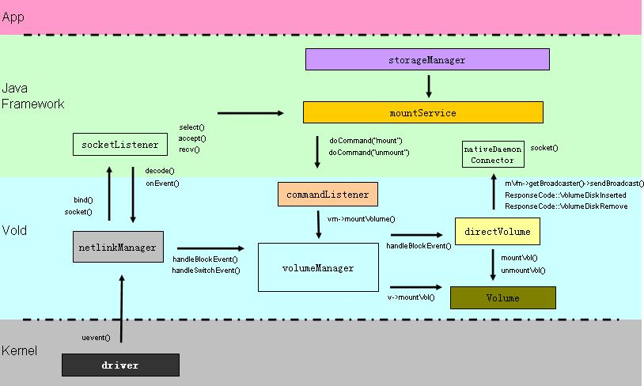

<!-- TOC -->

- [一 存储类型](#一-存储类型)
    - [1.1 RAM](#11-ram)
    - [1.2 ROM](#12-rom)
    - [1.3 eMMC存储介质](#13-emmc存储介质)
- [二 Android文件系统分区](#二-android文件系统分区)
- [三 Android分区mount流程](#三-android分区mount流程)
- [四 Android动态挂载外部存储](#四-android动态挂载外部存储)
    - [4.1 概述](#41-概述)
    - [4.2 Vold初始化](#42-vold初始化)
    - [4.3 NetlinkManager与Kernel的交互](#43-netlinkmanager与kernel的交互)
    - [4.4 VolumeManager的事件处理](#44-volumemanager的事件处理)
    - [4.5 CommandListener/CryptCommandListener与上层的交互](#45-commandlistenercryptcommandlistener与上层的交互)

<!-- /TOC -->

本文主要是介绍在Android平台上的文件存储实现方式，本文的参考平台是基于MTK的Android O(SDK26)。

# 一 存储类型

目前，移动平台上用到的储存介质主要分为两大类：RAM和ROM。

## 1.1 RAM

RAM是指随机存取存储器(Random Access Memory)，也叫做内存，其上的数据掉电丢失，不能永久存储。RAM又分为DRAM(Dynamic Random Access Memory)和SRAM(Static Random Access Memory)，动态随机存取存储器（Dynamic Random Access Memory，DRAM）是一种常见的随机存取存储器，主要的作用原理是利用内存储的多寡来代表一个（bit）是1还是0。由于在现实中电容会有漏电的现象，导致电位差不足而使记忆消失，因此除非电容经常周期性地充电，否则无法确保记忆长存。由于这种需要定时刷新的特性，因此被称为“动态”存储器。相对来说，“静态”存储器只要存入数据后，纵使不刷新也不会丢失记忆。DRAM还包含SDRAM(Synchronous Dynamic Random Access Memory)和DDR(Double Data Rate Synchronous Dynamic Random Access Memory)，目前手机上大部分用DDR作为内存来使用。

## 1.2 ROM

ROM是指只读存储器(Read-Only Memory)，其特点是数据一旦写入，将无法更改或者删除，且掉电之后数据不会丢失，要修改数据只能用特俗方式擦除重新复写。ROM包含PROM、EPROM、OTPROM、EEPROM以及Flash等，而手机平台用的最多的是Flash，Flash又分为Nor Flash和Nand Flash，eMMC等，目前用的最多的是eMMC作为手机存储使用。

## 1.3 eMMC存储介质

eMMC(Embedded Multi Media Card)是MMC协会订立、主要针对手机或平板电脑等产品的内嵌式存储器标准规格。eMMC在封装中集成了一个控制器，提供标准接口并管理闪存，使得手机厂商就能专注于产品开发的其它部分，并缩短向市场推出产品的时间。

> [EMMC 介绍](http://blog.csdn.net/u014645605/article/details/52061034)

# 二 Android文件系统分区

> [高通分区模块总结](http://blog.csdn.net/jerome198707/article/details/41512419)

# 三 Android分区mount流程

# 四 Android动态挂载外部存储

## 4.1 概述

Vold是Volume Daemon的缩写，是Android平台用于管理和控制外部存储的后台进程，其主要的功能包括SD卡、OTG设备的热插拔管理、挂载、卸载、格式化等。

Vold主要涵盖了Kernel驱动事件上报、Vold事件处理、与Framework层StorageManagerService和StorageManager交互，整体框架如图所示。



Vold层主要包含NetlinkManager、VolumeManager和CommandListener/CryptCommandListener四个线程协作处理来自Kernel的uevent事件以及上层下发的对外部存储的操作命令。

- NetlinkManager：接收来自Kernel的uevent事件，并把消息转发给VolumeManager做进一步处理。
- VolumeManager：Vold的核心管理模块，处理来自NetlinkManager消息，并将结果通过CommandListener发送给StorageManagerService，以及处理来自StorageManagerService的操作指令，并调用Volume做相应处理，如SD卡挂载、卸载。
- CommandListener/CryptCommandListener：通过socket实现Vold与StorageManagerService的消息交互。

## 4.2 Vold初始化

首先，在开机的时候，init进程通过vold.rc(Android 7.0以前是定义在init.rc文件中)中定义的服务启动vold进程。
> \<Android Project\>/system/vold/vold.rc

``` C++
service vold /system/bin/vold \
        --blkid_context=u:r:blkid:s0 --blkid_untrusted_context=u:r:blkid_untrusted:s0 \
        --fsck_context=u:r:fsck:s0 --fsck_untrusted_context=u:r:fsck_untrusted:s0
    class core
    socket vold stream 0660 root mount
    socket cryptd stream 0660 root mount
    ioprio be 2
    writepid /dev/cpuset/foreground/tasks
    shutdown critical
```

启动脚本中定义了两个socket，其中vold用于与上层交互。

启动Vold后，在主线程中，主要是做一些初始化操作。

> \<Android Project\>/system/vold/main.cpp

``` C++
int main(int argc, char** argv) {
    setenv("ANDROID_LOG_TAGS", "*:v", 1);
    android::base::InitLogging(argv, android::base::LogdLogger(android::base::SYSTEM));

    LOG(INFO) << "Vold 3.0 (the awakening) firing up";

    LOG(VERBOSE) << "Detected support for:"
            << (android::vold::IsFilesystemSupported("ext4") ? " ext4" : "")
            << (android::vold::IsFilesystemSupported("f2fs") ? " f2fs" : "")
            << (android::vold::IsFilesystemSupported("vfat") ? " vfat" : "");

    VolumeManager *vm;
    CommandListener *cl;
    CryptCommandListener *ccl;
    NetlinkManager *nm;

    parse_args(argc, argv);

    sehandle = selinux_android_file_context_handle();
    if (sehandle) {
        selinux_android_set_sehandle(sehandle);
    }

    // Quickly throw a CLOEXEC on the socket we just inherited from init
    // 获取在启动脚本中定义的socket句柄，并为之设置FD_CLOEXEC标志
    fcntl(android_get_control_socket("vold"), F_SETFD, FD_CLOEXEC);
    fcntl(android_get_control_socket("cryptd"), F_SETFD, FD_CLOEXEC);

    // 创建驱动节点，用于存放外部设备的挂载信息
    mkdir("/dev/block/vold", 0755);

    /* For when cryptfs checks and mounts an encrypted filesystem */
    klog_set_level(6);

    /* Create our singleton managers */
    // 创建VolumeManager实例
    if (!(vm = VolumeManager::Instance())) {
        LOG(ERROR) << "Unable to create VolumeManager";
        exit(1);
    }

    // 创建NetlinkManager实例
    if (!(nm = NetlinkManager::Instance())) {
        LOG(ERROR) << "Unable to create NetlinkManager";
        exit(1);
    }

    if (property_get_bool("vold.debug", false)) {
        vm->setDebug(true);
    }

    // 创建CommandListener和CryptCommandListener
    cl = new CommandListener();
    ccl = new CryptCommandListener();
    vm->setBroadcaster((SocketListener *) cl);
    nm->setBroadcaster((SocketListener *) cl);

    // 启动VolumeManager
    if (vm->start()) {
        PLOG(ERROR) << "Unable to start VolumeManager";
        exit(1);
    }

    bool has_adoptable;

    // 解析fstab
    if (process_config(vm, &has_adoptable)) {
        PLOG(ERROR) << "Error reading configuration... continuing anyways";
    }

    // 启动NetlinkManager
    if (nm->start()) {
        PLOG(ERROR) << "Unable to start NetlinkManager";
        exit(1);
    }

    /*
     * Now that we're up, we can respond to commands
     */
     // 启动CommandListener和CryptCommandListener
    if (cl->startListener()) {
        PLOG(ERROR) << "Unable to start CommandListener";
        exit(1);
    }

    if (ccl->startListener()) {
        PLOG(ERROR) << "Unable to start CryptCommandListener";
        exit(1);
    }

    // This call should go after listeners are started to avoid
    // a deadlock between vold and init (see b/34278978 for details)
    property_set("vold.has_adoptable", has_adoptable ? "1" : "0");

    // Do coldboot here so it won't block booting,
    // also the cold boot is needed in case we have flash drive
    // connected before Vold launched
    // 向/sys/block/uevent文件写入“add\n”，主动触发Kernel向NetlinkManager发送uevent，获取当前块设备信息，以检测是否有外部设备在Vold启动前已挂载
    coldboot("/sys/block");
    // Eventually we'll become the monitoring thread
    while(1) {
        pause();
    }

    LOG(ERROR) << "Vold exiting";
    exit(0);
}
```

从入口函数可以看出，主线程主要是创建并启动了NetlinkManager、VolumeManager、CommandListener和CryptCommandListener四个线程，由于CommandListener与CryptCommandListener大体流程相近，此处仅对CommandListener做分析。

## 4.3 NetlinkManager与Kernel的交互

## 4.4 VolumeManager的事件处理

## 4.5 CommandListener/CryptCommandListener与上层的交互
