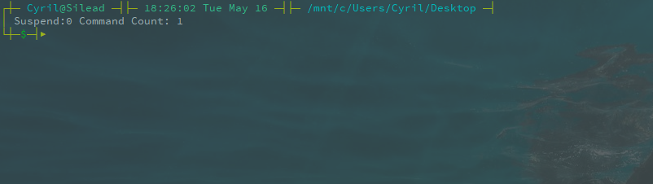
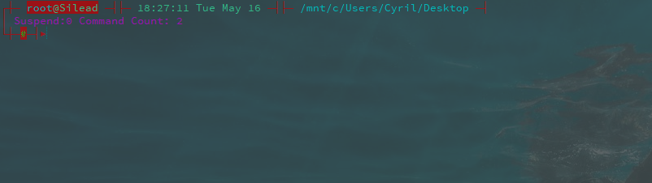

# Ubuntu系统配置

<!-- TOC -->

- [Ubuntu系统配置](#ubuntu系统配置)
    - [1. 终端命令符](#1-终端命令符)

<!-- /TOC -->

## 1. 终端命令符
普通用户模式：
> PS1="\[\033[0;33m\]┌┼─ \[\033[0;36m\]\u\[\033[0m\]@\H\[\033[0m\033[0;33m\] ─┤├─ \[\033[0m\]\t \d\[\033[0;33m\] ─┤├─ \[\033[0;36m\]\w\[\033[0;33m\] ─┤ \n│\[\033[0;37m\] Suspend Process:\j Command Counts: \#\n\[\033[0;33m\]└┼─\[\033[0m\033[0;32m\]\$\[\033[0m\033[0;33m\]─┤▶\[\033[0m\]"
预览：



Root用户模式：
> PS1="\[\033[0;31m\]┌┼─ \[\033[0;36;41m\]\u\[\033[0;41m\]@\H\[\033[0;31m\] ─┤├─ \[\033[0m\]\t \d\[\033[0;31m\] ─┤├─ \[\033[0;36m\]\w\[\033[0;31m\] ─┤ \n│\[\033[0;35m\] Suspend Process:\j Command Counts: \#\n\[\033[0;31m\]└┼─\[\033[0;32;41m\]\\$\[\033[0;31m\]─┤▶\[\033[0m\]"

预览：




``` shell
if [ `id -u` -eq 0 ]; then
    PS1="\[\033[0;31m\]┌┼─ \[\033[0;36;41m\]\u\[\033[0;41m\]@\H\[\033[0;31m\] ─┤├─ \[\033[0m\]\t \d\[\033[0;31m\] ─┤├─ \[\033[0;36m\]\w\[\033[0;31m\] ─┤ \n│\[\033[0;35m\] Suspend Process:\j Command Counts: \#\n\[\033[0;31m\]└┼─\[\033[0;32;41m\]\\$\[\033[0;31m\]─┤▶\[\033[0m\]"
else
    PS1="\[\033[0;33m\]┌┼─ \[\033[0;36m\]\u\[\033[0m\]@\H\[\033[0m\033[0;33m\] ─┤├─ \[\033[0m\]\t \d\[\033[0;33m\] ─┤├─ \[\033[0;36m\]\w\[\033[0;33m\] ─┤ \n│\[\033[0;37m\] Suspend Process:\j Command Counts: \#\n\[\033[0;33m\]└┼─\[\033[0m\033[0;32m\]\$\[\033[0m\033[0;33m\]─┤▶\[\033[0m\]"
fi
```

提供编译程序必须软件包的列表信息
> sudo apt-get install build-essential
